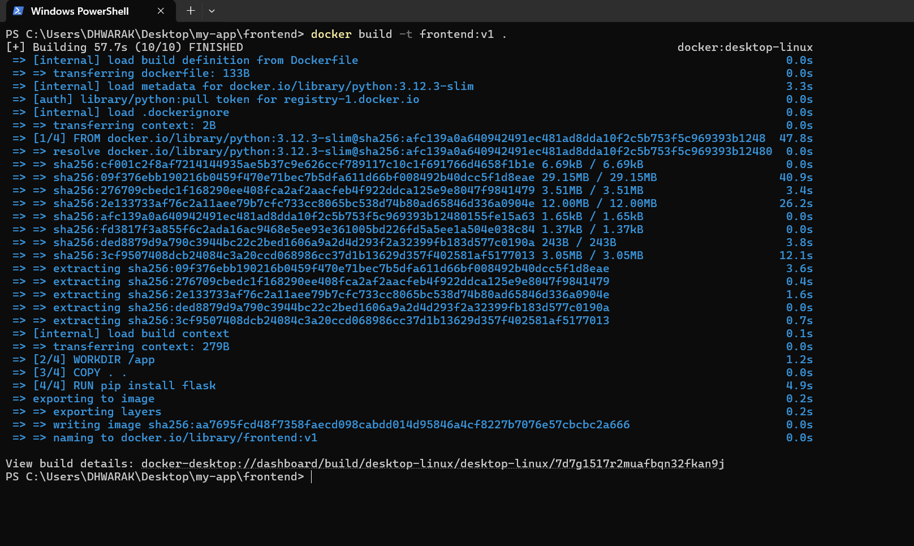
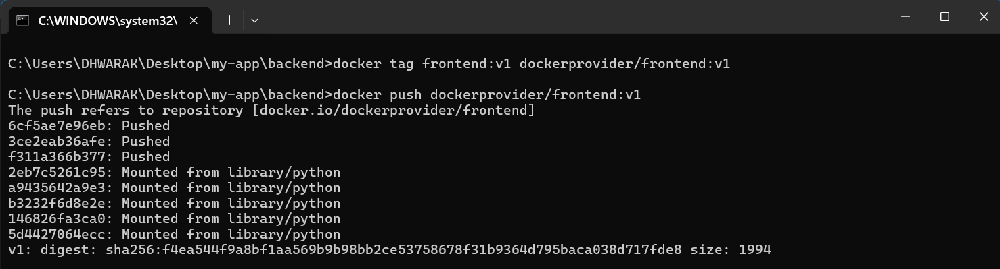
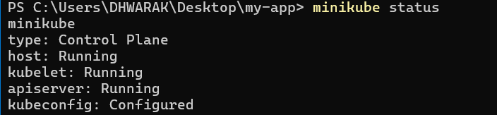
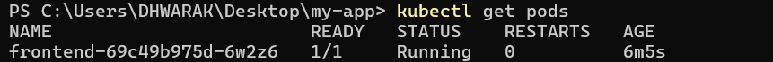
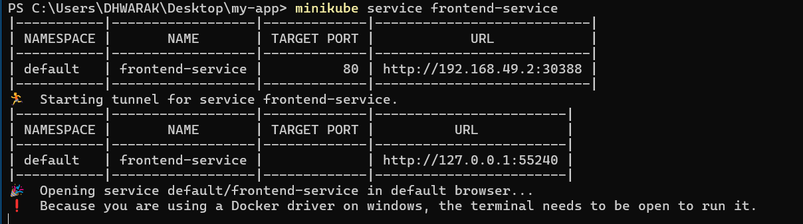
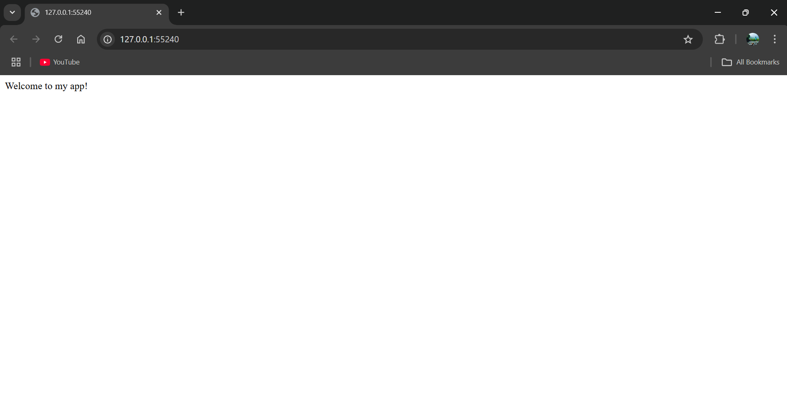

# 🚀 Flask Kubernetes Deployment Project  


**A professional deployment of a Flask application on Kubernetes**    

---

## 🌟 Project Overview
This project demonstrates a production-grade deployment of a Flask web application on Kubernetes, featuring:
- Containerization with Docker
- Kubernetes orchestration
- Load balancing with NodePort service
- Scalable deployment configuration

---

## ✨ Features
- **Simple Flask Web Server**: Minimalist web application with single endpoint
- **Dockerized Environment**: Reproducible container build
- **Kubernetes Deployment**: Cloud-native deployment manifests
- **Service Exposure**: External access via NodePort

---

## 🛠 Prerequisites


- [Docker Desktop](https://www.docker.com/products/docker-desktop)
- [Minikube](https://minikube.sigs.k8s.io/docs/start/)
- [kubectl](https://kubernetes.io/docs/tasks/tools/)
- Docker Hub Account

---

## 📂 Project Structure
```
Kubernetes-PythonApp/
├── frontend/
│ ├── app.py            # Flask application
│ ├── Dockerfile        # Container configuration
│ └── requirements.txt  # Python dependencies
├── manifests/
│ ├── deployment.yaml   # Kubernetes deployment
│  └──  service.yaml    # Kubernetes service
└── Screenshots/        # Contains Screensnaps of the Project
 
```

---

## 🚦 Deployment Guide

### 1. Build Docker Image
```bash
cd frontend
docker build -t dockerprovider/flask-app:v1 .
```
### 2. Push to Container Registry

```bash
docker push <DOCKERHUB_USERNAME>/flask-app:v1
```
### 3. Deploy to Kubernetes

```bash
kubectl apply -f manifests/
```
### 4. Verify Deployment

```bash
kubectl get pods
kubectl get services
```
### 5. Access Application
```bash
minikube service flask-service
```
---

## 📸 Screenshots  
### 1. The 'docker build' output:  
  

### 2. The 'docker tag and push' output: 
  

### 3. The 'minikube status' output:  
  

### 4. The Kubernetes pod status:  
 

### 5. Application Deployed and Running in browser: 
 


---

## 🧹 Cleanup
```bash

kubectl delete -f manifests/
minikube delete
```
*By [Your Name] • 📧 [Your Email] • 💼 [LinkedIn Profile]*
